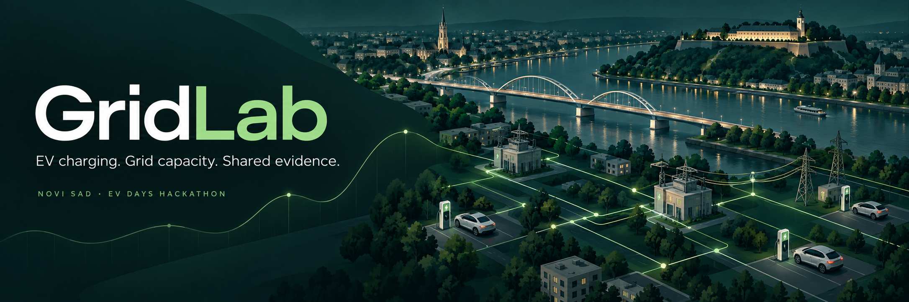

# GridLab: EV Charging and Power Grid Simulator

**Design a charging scenario. Compare controllers. Inspect the energy and grid constraints behind each result.**

GridLab is a Windows EV charging simulator for the Schneider Electric EV Days hackathon.
It uses OpenStreetMap data and pandapower to model charging demand on a synthetic Novi Sad power grid.
Compare charging optimization, grid capacity, reinforcement learning, and Codex workflows through the Model Context Protocol (MCP).

**Nikola Jokić, Mina Grković, Selena Grković, and Dušan Grković** developed GridLab for the **Schneider Electric EV Days Challenge hackathon**.
Team: **Jokić & Grković³**.

[Windows setup](#start-on-windows) · [Application tour](#application-tour) · [Algorithms](#charging-algorithms) · [Benchmarks](#benchmarks) · [Codex and MCP](#codex-and-mcp) · [User guide](docs/USER_GUIDE.md)

> [!IMPORTANT]
> The network is a synthetic planning proxy. It is not an as-built EDS model or a utility-certified capacity assessment.
> The banner is concept artwork. The application images below are actual Windows browser captures.

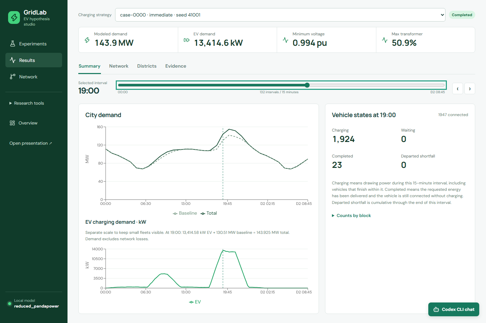

At 19:00, this local experiment has 1,947 connected vehicles and about 13.4 MW of EV charging demand.
The completed run contains 5,000 whole-day charging visits. The charts separate baseline demand from EV demand.

## Contents

- [Start on Windows](#start-on-windows)
- [Application tour](#application-tour)
- [Charging algorithms](#charging-algorithms)
- [Algorithm development with Codex](#algorithm-development-with-codex)
- [Benchmarks](#benchmarks)
- [Reinforcement learning](#reinforcement-learning)
- [Codex and MCP](#codex-and-mcp)
- [System architecture](#system-architecture)
- [Simulator data and validation](#simulator-data-and-validation)
- [Study results and limits](#study-results-and-limits)
- [Repository structure](#repository-structure)
- [Local verification](#local-verification)
- [Documentation and sources](#documentation-and-sources)

## Start on Windows

### Requirements

| Requirement | Purpose |
| --- | --- |
| Windows with PowerShell 5.1 or PowerShell 7 | Run setup and launch scripts |
| [64-bit Python 3.11](https://www.python.org/downloads/windows/) | Simulator, API, and training |
| [Node.js 24](https://nodejs.org/en/download) | Build the application and presentation |
| Git | Clone and update the repository |
| Edge or Chrome | Use the local application |
| Internet during setup | Download dependencies |

Setup includes PyTorch, Gymnasium, and Stable-Baselines3. No separate RL installation is necessary.
Live chat requires an installed and authenticated Codex CLI. Ordinary simulation does not require Codex authentication.

### Install and launch

1. Clone the repository.

   ```powershell
   git clone https://github.com/Grkila/gridlab-ev-grid-simulator.git
   cd gridlab-ev-grid-simulator
   ```

2. Install dependencies and build the interfaces.

   ```powershell
   powershell -NoProfile -ExecutionPolicy Bypass -File .\scripts\setup.ps1
   ```

3. Start the application.

   ```powershell
   powershell -NoProfile -ExecutionPolicy Bypass -File .\scripts\start.ps1
   ```

The browser opens at [127.0.0.1:8517](http://127.0.0.1:8517/) after the server responds.
Keep the terminal open. Press **Ctrl+C** in that terminal to stop the server.
Cancel active experiments or training through their application controls before shutdown.

Setup creates the repository `.venv`. It does not start experiments or training.
The execution-policy argument affects only that PowerShell process.
For PowerShell 7, replace `powershell` with `pwsh` in these commands.

<details>
<summary>Explicit Python path, alternate port, and other launch options</summary>

Use an explicit interpreter if the Python launcher cannot locate Python 3.11:

```powershell
powershell -NoProfile -ExecutionPolicy Bypass -File .\scripts\setup.ps1 -PythonPath "C:\Python311\python.exe"
```

Replace the example path with your installed 64-bit Python 3.11 executable.

| Option | Effect |
| --- | --- |
| `-Port 8520` | Use another local port |
| `-NoBrowser` | Print the address without opening a browser |
| `-Presentation` | Open the existing presentation |

```powershell
powershell -NoProfile -ExecutionPolicy Bypass -File .\scripts\start.ps1 -Port 8520 -NoBrowser
```

An absolute path permits startup from another directory, including paths with spaces:

```powershell
powershell -NoProfile -ExecutionPolicy Bypass -File "C:\Projects\EV days\scripts\start.ps1"
```

</details>

### First experiment

A fresh clone has no saved playground results or trained models.
The screenshots show local records. Their runtime JSON is not included in Git.

1. Open **Experiments**.
2. Give the experiment a name and choose a calibrated day.
3. Open **Vehicles** and set a small fleet, such as 20 vehicles.
4. Open **Strategies** and select **Immediate**.
5. Open **Review** and inspect the limits and execution budget.
6. Select **Save & run**.
7. Wait for the run to finish.
8. Open **Results** and inspect its case, energy delivery, and constraint status.

Some result catalogs and maps take longer to load. Wait for their content before changing views or repeating a request.
A finished run can contain failed constraints or unmet charging demand.
See the [first-run procedures](docs/USER_GUIDE.md#experiments) and [Windows troubleshooting guide](docs/TROUBLESHOOTING.md).

### Update and troubleshoot

1. Cancel active jobs and stop the server with **Ctrl+C**.
2. Run `git status --short` and review local source changes.
3. Run `git pull --ff-only` when your checkout is ready to update.
4. Run `scripts/setup.ps1` with the setup command above.
5. Start the application and reload the browser.

Repeat setup preserves the environment and user data. Do not delete saved runs to repair a dependency or browser problem.
The [troubleshooting guide](docs/TROUBLESHOOTING.md) covers prerequisite failures, ports, slow loading, map tiles, training, and benchmark failures.

## Application tour

| Question | Workspace and evidence |
| --- | --- |
| When and where do vehicles charge? | Experiments: charging schedule, fleet mix, and placement |
| How much charging power is required now? | Results: interval selector, EV curve, and vehicle states |
| Which areas approach their capacity? | Network map, block heatmap, district load, and transformer charts |
| Why does one controller behave differently? | Strategies: allocation rule, inputs, forecasts, and limitations |
| Is the comparison fair? | Benchmarks: frozen inputs, common seeds, and trial history |
| Did the learned controller meet demand? | Training and Results: reward, shortfall, constraints, and individual chargers |
| Can an assistant repeat the workflow? | Codex and MCP: structured tools, saved definitions, and inspectable evidence |

### Configure demand and charging visits

The editor has four stages: **Scenario**, **Vehicles**, **Strategies**, and **Review**.
Advanced panels expose the assumptions used in the calculation.

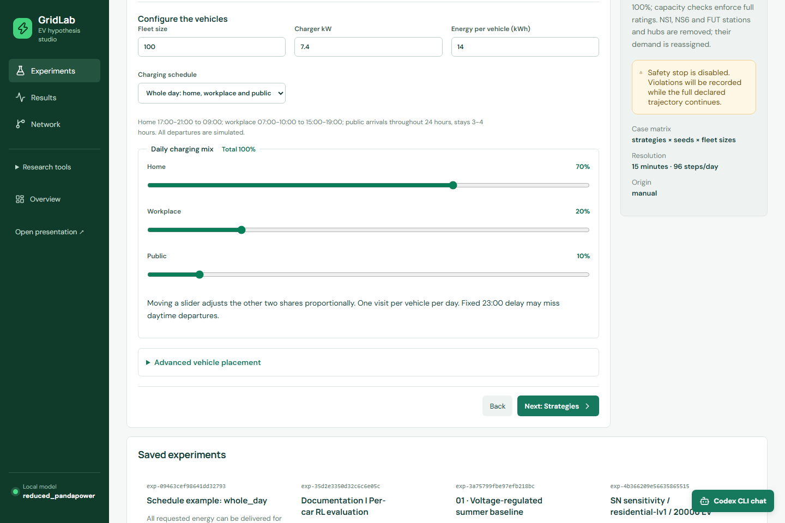

**Home only** models overnight residential visits.
**Whole day** adds workplace and public visits. Its initial mix is 70% home, 20% workplace, and 10% public.
Each vehicle has one charging visit per day. Moving one mix slider adjusts the other shares to keep their sum at 100%.
The initial charger rating is 7.4 kW. Each vehicle requests 14 kWh of battery energy, with 90% charging efficiency.

| Assumption | What it controls |
| --- | --- |
| Calibrated day and monthly energy | Seasonal baseline demand and daily energy normalization |
| Base / worst-case day | Normal demand or a 20% baseline increase |
| Annual growth and years ahead | Compounded future baseline demand |
| City or retained-source scope | Interpretation of the supplied consumption total |
| Grid input or load consumption | Whether supplied energy includes modeled network losses |
| Original or regulated grid | Source voltage and baseline peak treatment |
| Placement and district | Distribution of charging visits across modeled demand blocks |
| LV shares and district estimates | Downstream planning limits and capacity provenance |
| Seeds, assertions, and duration | Reproducibility, acceptance rules, and execution bounds |

The regulated setting uses a 1.04 pu source voltage and shifts baseline energy to limit its peak to 220 MW.
It preserves daily baseline energy. Results from this setting require separate interpretation from the original-grid study.

<details>
<summary>Inspect the demand and capacity panels</summary>

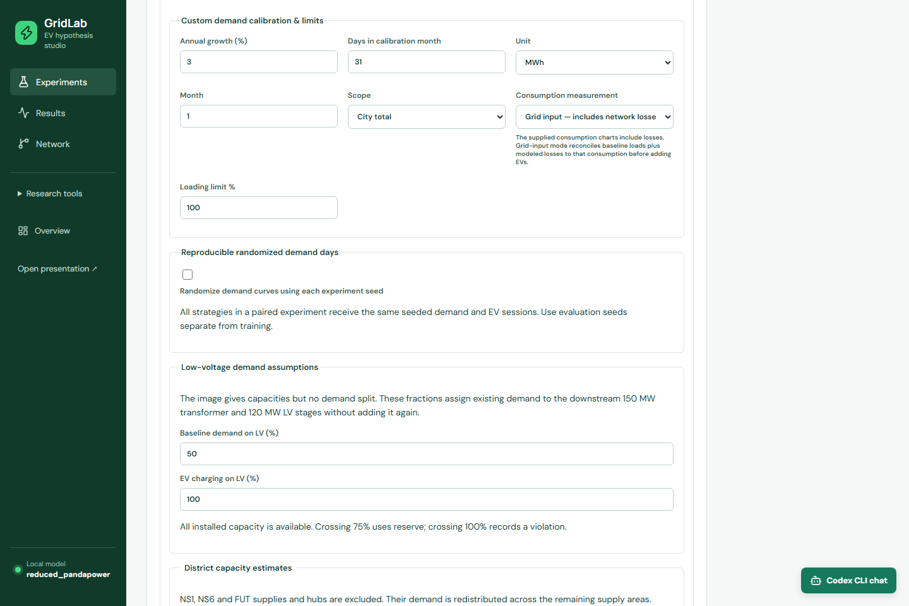

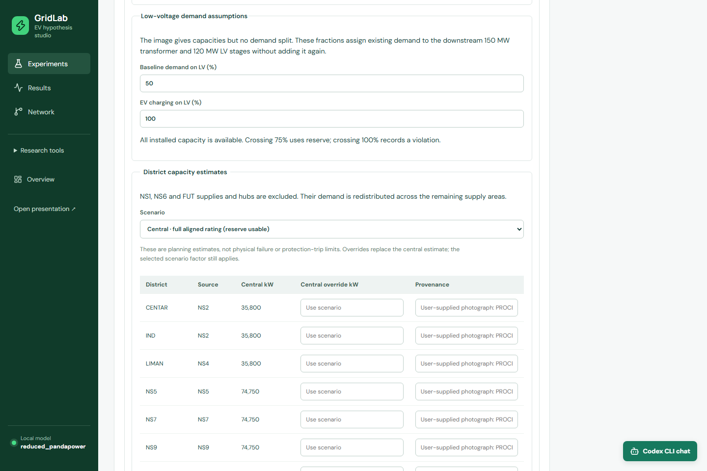

Capacity values are planning estimates. The interface retains their provenance.
The LV shares allocate existing demand to downstream stages. They do not add the demand a second time.

</details>

### Follow vehicles through the day

The result time selector uses 15-minute intervals.
The map and charts use the same selected interval, including the next day when departure completion extends the run.

| 09:00: workplace and public visits | 19:00: evening arrivals |
| --- | --- |
|  | 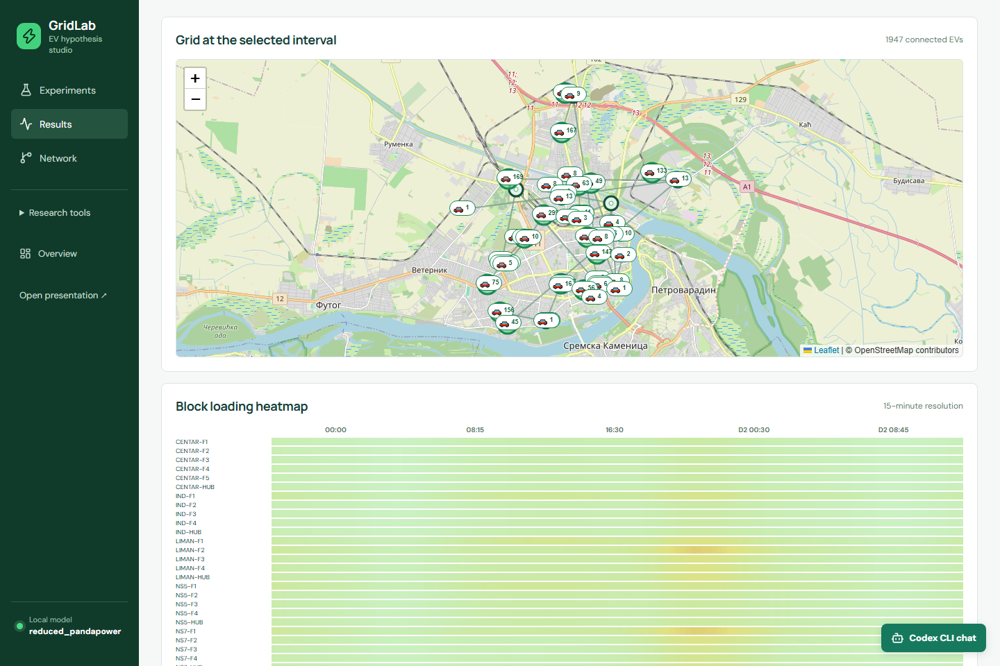 |

These images show the same completed 5,000-vehicle experiment.
The map has 763 connected vehicles at 09:00 and 1,947 at 19:00.
Car badges aggregate visits at a demand block. They do not represent GPS tracks or a traffic simulation.

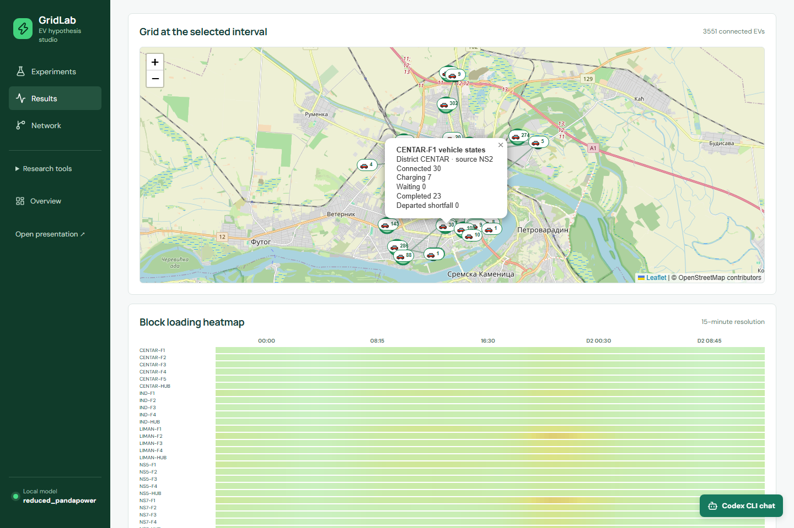

Select a car badge to inspect connected, charging, waiting, completed, and departed-shortfall counts.
Select electrical map elements to inspect their modeled values.
The separate **Network** workspace shows supply and delivery relationships.

### Read exact demand and capacity

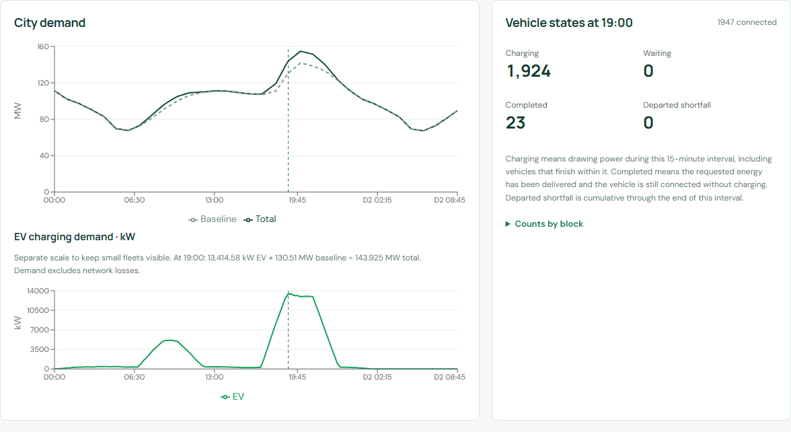

The city curve uses **MW**. The separate EV curve uses **kW** so small fleets remain visible.
At 19:00, the displayed calculation is approximately 130.51 MW baseline plus 13,414.58 kW EV demand, giving 143.925 MW total.
Demand curves exclude network losses. Evidence metrics identify grid input when losses are included.

**Charging** means a vehicle draws power during the selected interval.
**Completed** means it has received its requested energy and remains connected without charging.
**Departure shortfall** counts vehicles that left without enough energy.

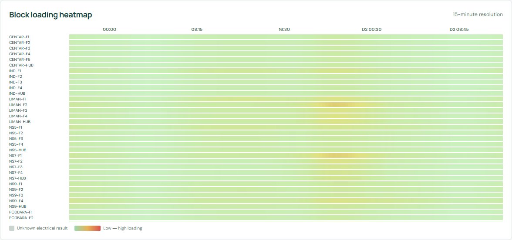

The heatmap compares demand blocks across time. Gray cells mean unknown electrical results.
Color shows relative loading. Use exact electrical values and limits to decide whether a case passes.

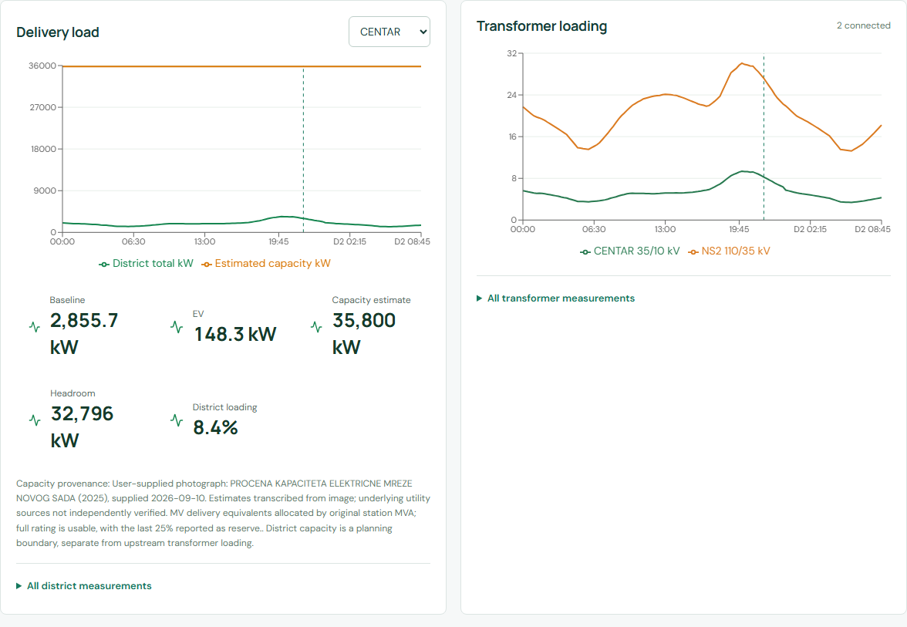

The **Districts** view separates district delivery capacity from upstream transformer loading.
The **Evidence** view reports energy delivery, reserve use, stage limits, and assertion outcomes.
The 1,178 MW infrastructure total spans successive stages. It is not one additive pool of available supply.

See [Results instructions](docs/USER_GUIDE.md#results) for comparisons, run management, table expansion, and result interpretation.

## Charging algorithms

The controller library states what each controller observes and how it assigns power.
Controllers share the experiment's vehicles, demand, seed, and electrical model.

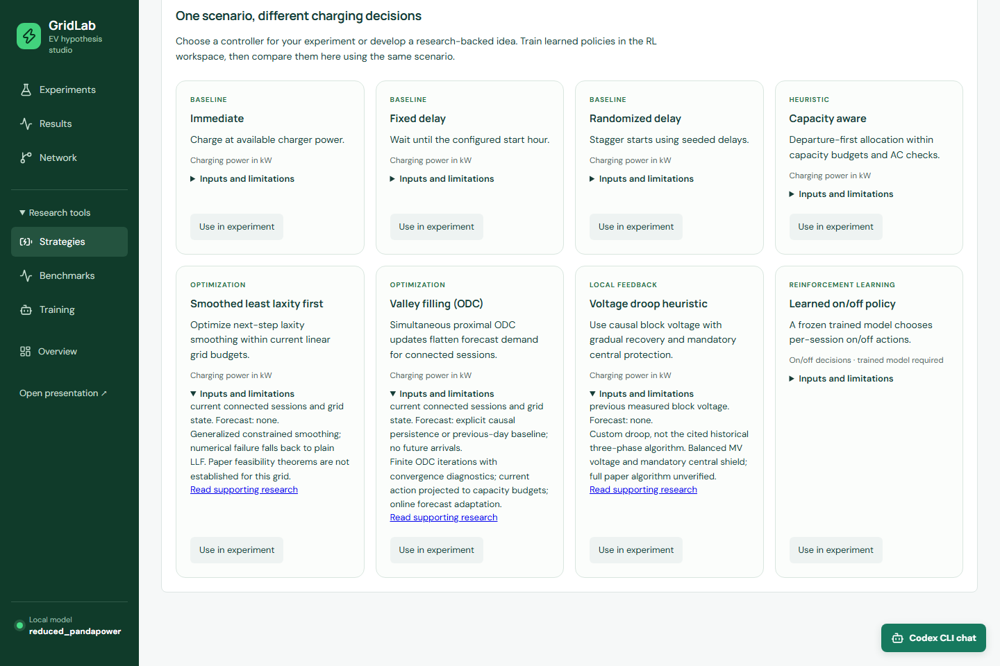

| Controller | Decision rule | Main limitation |
| --- | --- | --- |
| Immediate | Charge at available charger power after arrival | Simultaneous arrivals can create a peak |
| Fixed delay | Wait for the configured charging start hour | A late start can miss daytime departures |
| Randomized delay | Stagger starts with seeded delays | Random staggering does not guarantee grid feasibility |
| Capacity aware | Allocate by departure urgency within capacity budgets and AC checks | Results depend on available headroom and protection actions |
| Smoothed least laxity first | Smooth next-step laxity within current linear grid budgets | Numerical failure falls back to plain least laxity first |
| Valley filling (ODC) | Iteratively allocate connected demand over a forecast horizon | Finite iterations and forecast errors affect the result |
| Voltage droop heuristic | Reduce charging from measured local block voltage | Balanced MV feedback is a proxy for local voltage behavior |
| Learned on/off policy | Use a saved policy to switch individual charging sessions | Requires a compatible model and separate evaluation evidence |

The historical MPC implementation is not an active library choice.
MCP refers to the assistant tool protocol and is unrelated to model predictive control.

### Optimization assumptions

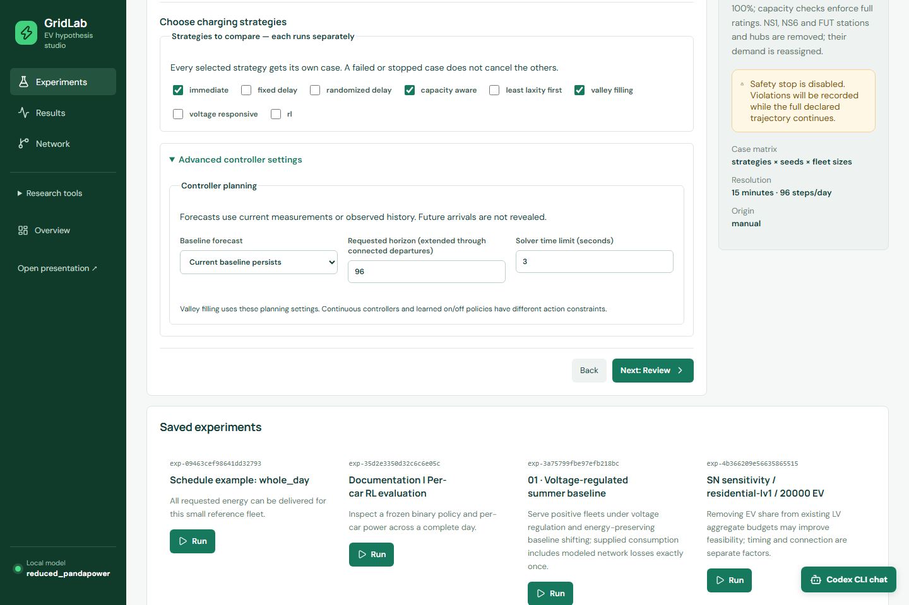

The initial planning horizon is 96 intervals. The solver budget is 3 seconds.
Valley filling can extend the requested horizon through known connected-session departures.
The baseline forecast uses current measurements or observed previous-day history.
Future arrivals are not revealed to the controller.

The application reports fallback intervals, iteration caps, and safety interventions.
A low peak alone does not establish better service. Check delivered energy, departure shortfall, voltage, and loading together.
See the [controller contracts](docs/baseline-strategy-contracts.md) and [research audit](docs/strategy-research-audit.md).

## Algorithm development with Codex

The **Strategy development** workspace connects an idea to a saved specification, an implementation task, and reproducible evaluation.
Each record preserves its predecessor so revisions do not erase earlier evidence.

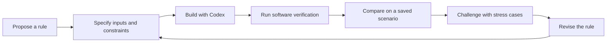
```mermaid
flowchart LR
  A[Propose a rule] --> B[Specify inputs and constraints]
  B --> C[Build with Codex]
  C --> D[Run software verification]
  D --> E[Compare on a saved scenario]
  E --> F[Challenge with stress cases]
  F --> G[Revise the rule]
  G --> B
```

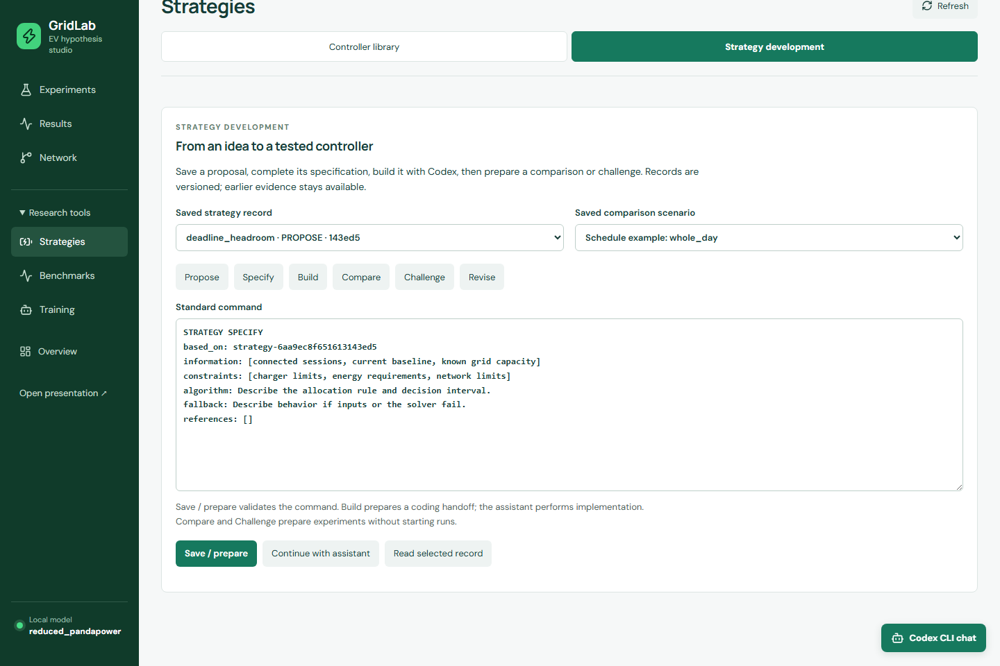

1. Open **Strategies → Strategy development**.
2. Use **Propose** to describe the rule, objective, and research basis.
3. Use **Specify** to define available information, constraints, allocation logic, fallback behavior, and references.
4. Save the specification and select **Build**.
5. Select **Continue with assistant** and review the prepared implementation request.
6. Use **Compare** with a saved scenario after implementation and software verification.
7. Use **Challenge** and **Revise** to test failure cases and record changes.

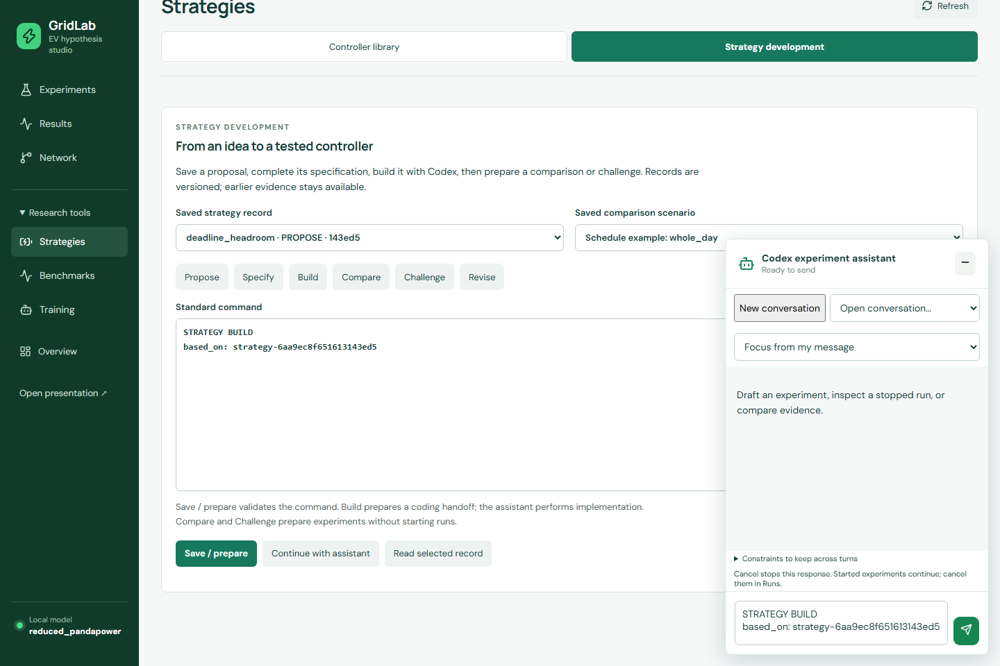

This capture shows a prepared request. It does not claim that the displayed proposal has been implemented.
**Build** prepares a coding handoff. Saving a proposal does not register a working controller.
Software verification establishes implementation checks. A completed experiment supplies separate performance evidence.
See the [strategy development guide](docs/strategy-development.md) for the command contract and required records.

## Benchmarks

Benchmarks compare service, electrical stress, and tested fleet capacity under frozen conditions.
The dashboard links each algorithm and standard test to its metrics and trial history.

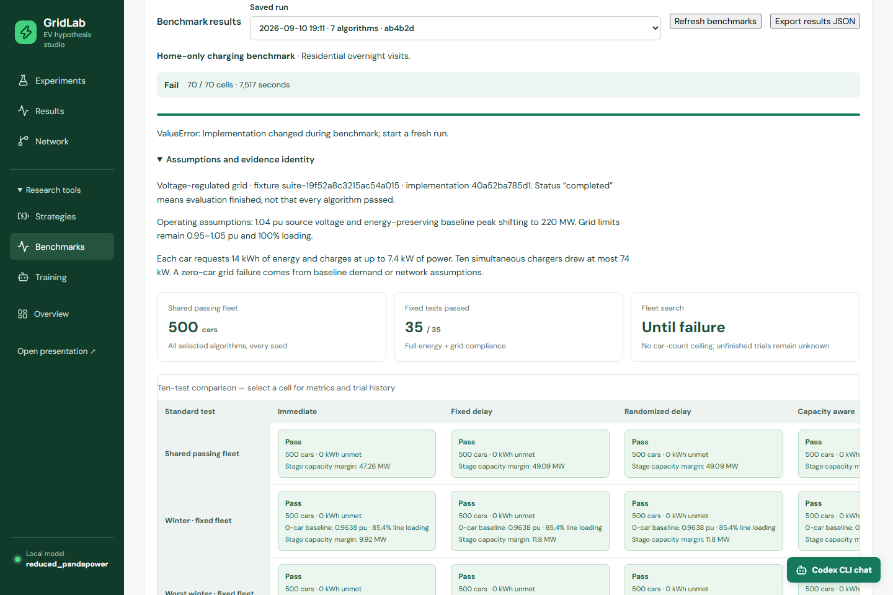

This archived local run retained 70 cells before an implementation-change check marked the job failed.
Its retained rows remain inspectable. The failed job does not establish a completed benchmark against the current implementation.

### Why there are ten tests

| Standard test | Rationale |
| --- | --- |
| Shared passing fleet | Find a common tested fleet that every selected algorithm serves |
| Winter, fixed fleet | Check seasonal demand with the same fleet |
| Worst winter, fixed fleet | Check January demand with a 20% increase |
| Worst summer, fixed fleet | Check June demand with a 20% increase |
| Synchronized arrivals | Test a common 18:00 arrival surge |
| One district, fixed fleet | Test concentrated charging in the frozen busiest district |
| Citywide capacity, normal | Search the fleet ladder under normal June conditions |
| Citywide capacity, worst | Search the same ladder under worst winter conditions |
| District capacity, normal | Search with all EVs concentrated in one district |
| District capacity, worst | Combine district concentration with worst winter demand |

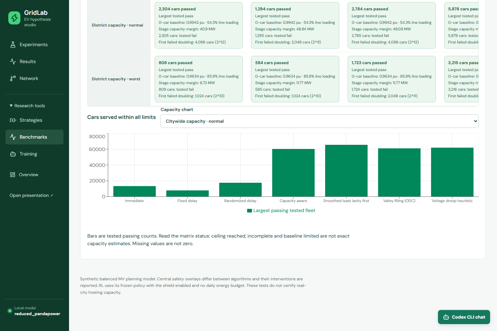

Bars show the largest passing tested counts in the selected family.
**Search ceiling reached** means the search stopped at its bound. **Unknown / incomplete** is not a zero-capacity result.
A zero-EV failure identifies a baseline limitation under those frozen conditions.

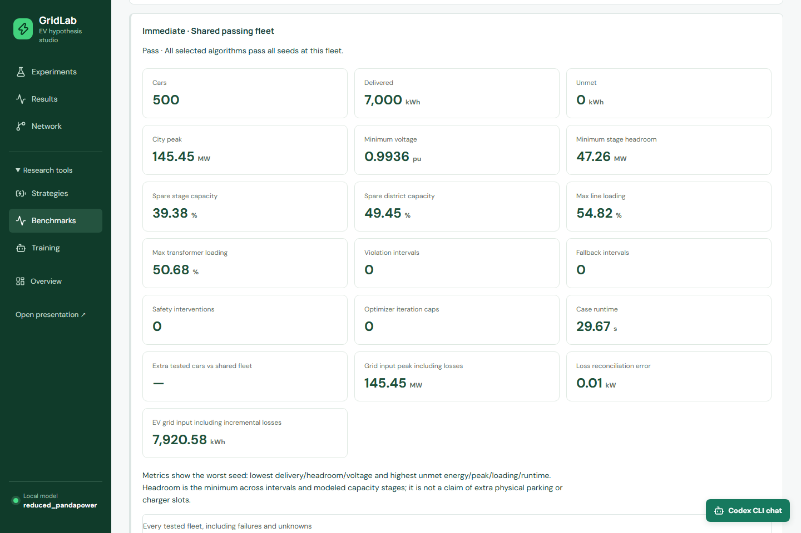

The selected historical cell serves 500 cars with 7,000 kWh delivered and no unmet energy.
Its 145.45 MW city peak belongs to that specific cell and saved implementation.
Inspect minimum voltage, line and transformer loading, headroom, interventions, and runtime before comparing controllers.

1. Select or create a frozen benchmark in **Setup**.
2. Choose algorithms and execution budgets.
3. Select **Run benchmark** and wait for recorded progress.
4. Open **Results** and select the saved run.
5. Select a matrix cell to inspect metrics and every tested fleet.
6. Use **Compare implementations** only after checking fixture and implementation identities.

Large fleets and multiple seeds can take substantial time. Budget-limited trials remain unknown.
The [benchmark guide](docs/benchmark.md) defines matching rules, search outcomes, and the pass criteria.

## Reinforcement learning

Training provides three distinct workflows. Their labels identify the type of evidence.

| Workflow | What executes | How to interpret it |
| --- | --- | --- |
| PPO demo | Playback of authored synthetic curves | Explains the learning process. It does not train a policy |
| Binary training | Real training of individual on/off charging decisions | Inspect episode reward, unmet energy, violations, and the saved model |
| PPO campaigns | Gymnasium and Stable-Baselines3 training against frozen benchmark anchors | Compare completed held-out evaluations with matched baselines |

### Demonstrate the learning process

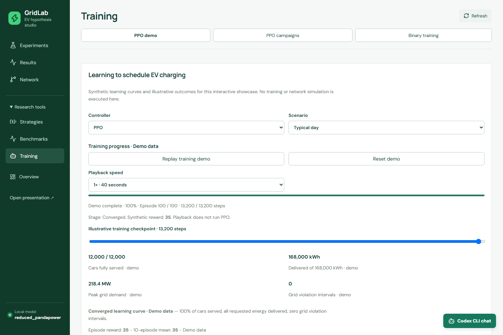

Select a scenario, replay the demo, change playback speed, or inspect a checkpoint.
The learning curve and displayed outcomes are illustrative. They are not a measured Novi Sad capacity result.

### Inspect interrupted real training

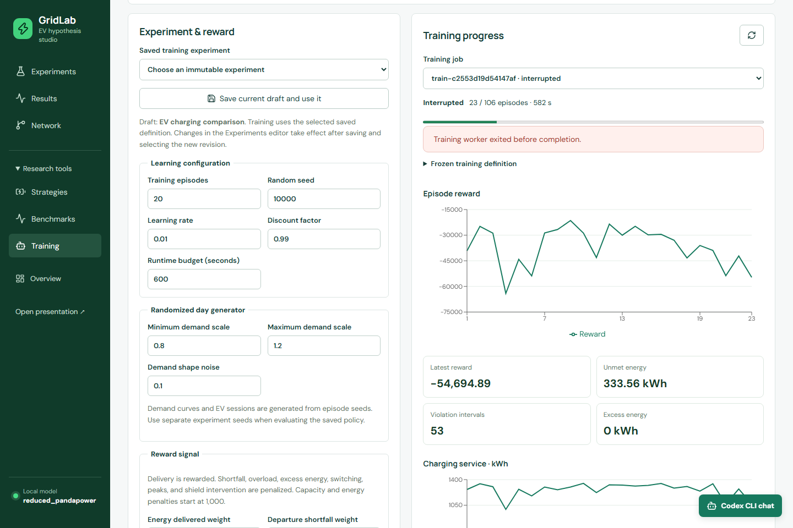

This actual job stopped after 23 of 106 episodes because its worker exited before completion.
Its retained reward and service history remain visible.
The latest displayed episode has 333.56 kWh of unmet energy and 53 violation intervals.
These values show why reward alone is insufficient to claim policy quality.

<details>
<summary>Continuous PPO campaign and checkpoint recovery</summary>

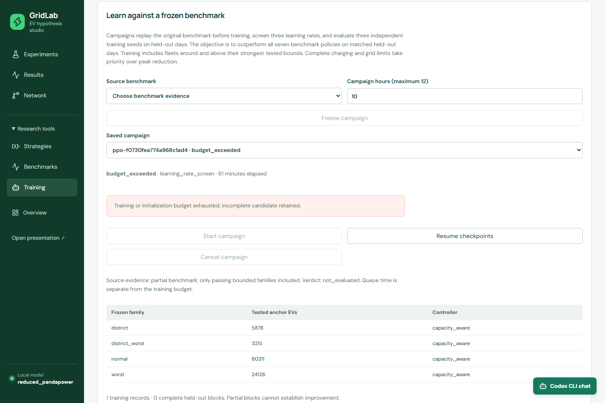

This saved campaign exhausted its training or initialization budget during learning-rate screening.
Its verdict remains `not_evaluated`. No complete held-out block supports an improvement claim.
**Resume checkpoints** continues an eligible campaign from retained state.
See [continuous RL](docs/continuous-rl.md) for the Gymnasium environment, frozen baseline replay, and evaluation protocol.

</details>

### Inspect one car's charging decision

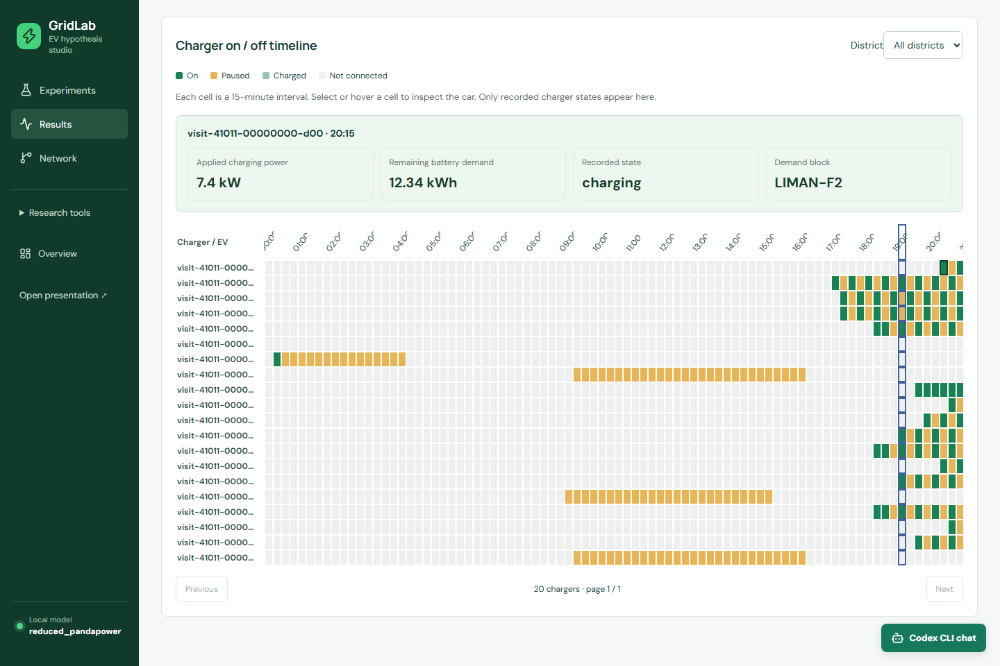

The **RL controller** result tab shows reward components, requested and executed charging, interventions, and individual charger states.
Select or hover a timeline cell to read the car ID, interval, applied power, remaining battery energy, and demand block.
Keyboard focus also exposes the selected cell's values.

This completed evaluation uses a real saved policy with 20 cars and a separate evaluation seed.
It delivered 224.985 kWh of 280 kWh requested, leaving 55.015 kWh unmet at departure.
It had no electrical violation intervals. That does not make it a successful charging-service result.

The [training instructions](docs/USER_GUIDE.md#training) cover settings, reward weights, cancellation, model selection, and evaluation.

## Codex and MCP

The browser chat and the MCP service use the same simulation service as the application.
The chat provides conversation history, task focus, pinned constraints, cancellation, and inspectable tool results.
Explicit implementation mode identifies the saved specification for a coding task.

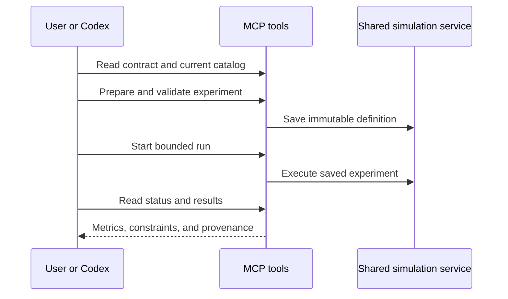
```mermaid
sequenceDiagram
  participant U as User or Codex
  participant T as MCP tools
  participant S as Shared simulation service
  U->>T: Read contract and current catalog
  U->>T: Prepare and validate experiment
  T->>S: Save immutable definition
  U->>T: Start bounded run
  T->>S: Execute saved experiment
  U->>T: Read status and results
  T-->>U: Metrics, constraints, and provenance
```

### Tool inventory

The current project MCP interface exposes 39 tools.
Read the live contract before constructing a request. Keep returned IDs for later calls.

| Purpose | Tools |
| --- | --- |
| Contract and catalogs | `ev_get_contract`, `ev_get_catalog`, `ev_get_strategy_catalog` |
| Experiment definitions | `ev_prepare_experiment`, `ev_validate_experiment`, `ev_save_experiment`, `ev_get_experiment`, `ev_list_experiments`, `ev_add_cases` |
| Scenarios | `ev_save_scenario`, `ev_get_scenario` |
| Run execution and evidence | `ev_start_run`, `ev_get_run`, `ev_cancel_run`, `ev_get_results`, `ev_compare_runs` |
| Algorithm development | `ev_propose_strategy`, `ev_specify_strategy`, `ev_strategy_command`, `ev_get_strategy_record`, `ev_verify_strategy`, `ev_get_strategy_verification` |
| Benchmarks | `ev_get_benchmark_catalog`, `ev_create_benchmark`, `ev_start_benchmark`, `ev_get_benchmark`, `ev_cancel_benchmark`, `ev_compare_benchmark` |
| Binary RL | `ev_get_rl_catalog`, `ev_train_rl`, `ev_get_rl_job`, `ev_cancel_rl` |
| Continuous PPO | `ev_get_continuous_rl_catalog`, `ev_create_continuous_campaign`, `ev_start_continuous_campaign`, `ev_get_continuous_campaign`, `ev_get_continuous_results`, `ev_resume_continuous_campaign`, `ev_cancel_continuous_campaign` |

For a stdio MCP client, use the repository Python executable and launcher:

```powershell
.\.venv\Scripts\python.exe .\scripts\run_playground_mcp.py
```

Use absolute paths in client configuration. The [agent contract](docs/agent-contract.md) documents the client setup and request rules.
Codex authentication belongs to the Windows account and remains separate from simulator setup.
Cancelling a chat response does not cancel a run that the simulator already accepted.

## System architecture

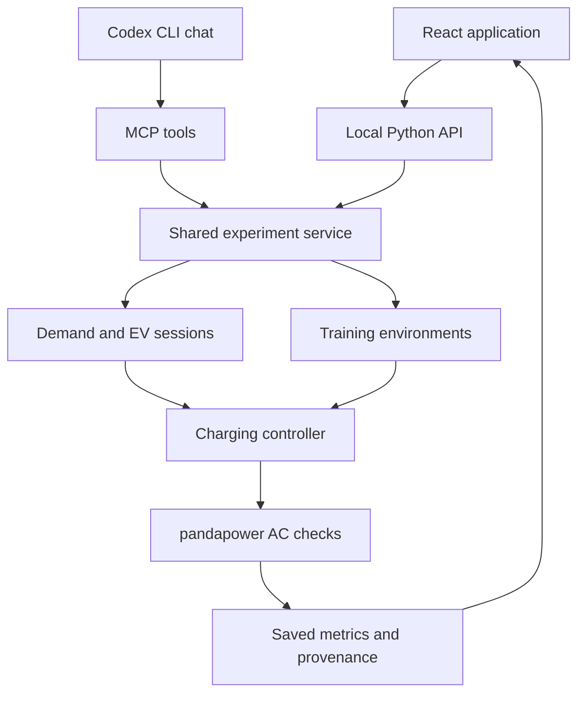
```mermaid
flowchart TD
  R[React application] --> A[Local Python API]
  C[Codex CLI chat] --> M[MCP tools]
  M --> S[Shared experiment service]
  A --> S
  S --> D[Demand and EV sessions]
  D --> K[Charging controller]
  K --> P[pandapower AC checks]
  P --> E[Saved metrics and provenance]
  E --> R
  S --> L[Training environments]
  L --> K
```

| Layer | Implementation |
| --- | --- |
| Browser application | React, TypeScript, Recharts, and Leaflet |
| Local service | Python experiment, benchmark, training, and chat endpoints |
| Electrical calculation | pandapower AC power flow |
| Continuous learning | PyTorch, Gymnasium, and Stable-Baselines3 |
| Assistant integration | Local Codex CLI and project MCP tools |
| Evidence | Immutable definitions, runtime records, and frozen published study artifacts |

### Two network representations

The detailed reference network preserves the OSM-derived reconstruction, shared topology, manifests, and validation report.
The reduced experiment network supports repeated 15-minute simulations with 52 delivery blocks, six retained supply areas, and 12 transformers.
The application redistributes excluded-source demand across retained areas.
Neither representation is an as-built utility model.

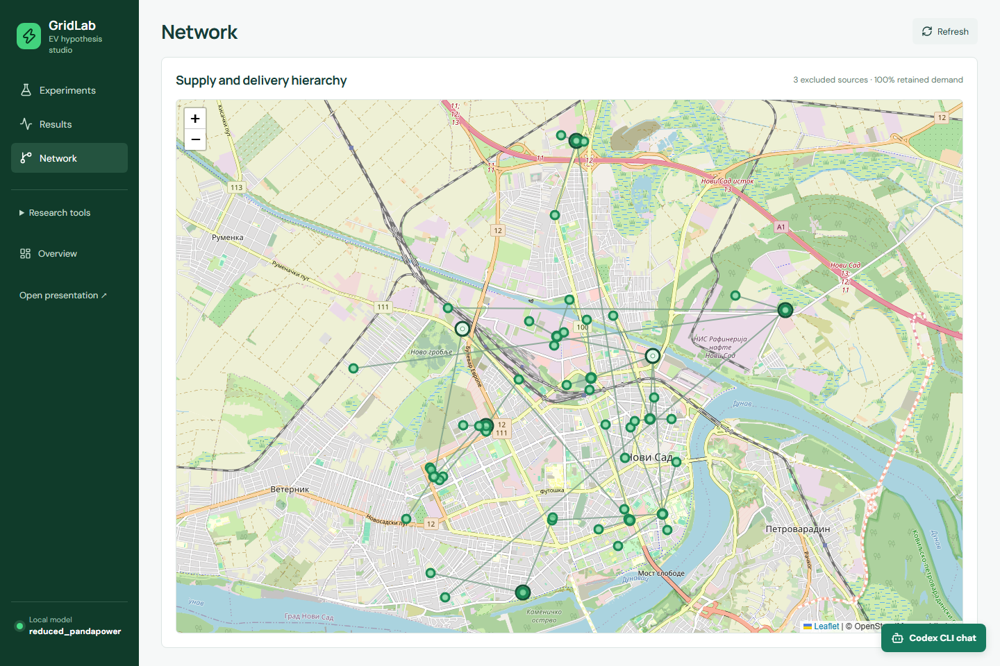

See [architecture](docs/architecture.md), [model methodology](docs/models/novi-sad.md), and [configuration](docs/CONFIGURATION.md) for assumptions and interfaces.

## Simulator data and validation

The simulator uses **pandapower AC power flow** at 15-minute intervals.
The detailed network combines OSM streets and land use with published EDS station information, synthetic service points, and inferred feeder routes.
Generic planning parameters fill gaps in equipment data.
The application reduces that network to 76 buses and 58 lines for repeated EV experiments.

| Input or method | How the simulator uses it |
| --- | --- |
| OSM geography | Locate demand and infer plausible routes. Streets are not verified cable routes |
| Published station information | Constrain station ratings and documented connections |
| Synthetic demand inventory | Represent 2,648 service points calibrated to the supplied annual energy |
| Seasonal usage curves | Interpolate four 24-hour profiles into 96 intervals per day |
| Monthly consumption | Scale the selected shape to monthly energy divided by the number of days |
| Loss-inclusive inputs | Reconcile zero-EV grid input before adding charging and incremental losses |
| Feeder reduction | Weight branch impedance by downstream demand and retain the weakest first-order path |
| Detailed replay | Apply selected block dispatch to the detailed model and compare electrical metrics |

January uses 120,000 MWh over 31 days. June uses 76,000 MWh over 30 days.
These supplied presets and seasonal profiles are scenario inputs, not an independently verified twelve-month meter series.
Matching their energy totals is calibration.

### What the reported near-99% agreement means

The saved 150 MW no-EV check compares one selected snapshot:

| Metric | Detailed | Reduced | Relative difference |
| --- | ---: | ---: | ---: |
| Minimum voltage | 0.981538 pu | 0.975102 pu | 0.656% |
| Maximum line loading | 49.1125% | 50.3952% | 2.612% |
| Maximum transformer loading | 52.1081% | 53.2799% | 2.249% |
| Modeled losses | 1,558.809 kW | 1,932.508 kW | 23.973% |

The voltage difference is 0.006436 pu.
Expressing its relative difference as `100% − error` gives 99.344% agreement for that metric and snapshot.
It does **not** establish 99% accuracy for the simulator, annual behavior, or EV hosting capacity.
The detailed model also contains inferred inputs.

The [simulator guide](docs/SIMULATOR.md) explains source provenance, monthly normalization, reduction formulas, charging optimization, and the exact comparison method.
The [saved evidence](artifacts/playground/evidence/model_validation.json) retains the numerical results and implementation fingerprint.

## Study results and limits

The completed direct study uses frozen conditions distinct from the application's regulated demonstration settings.
Its findings are conditional planning results.

| Direct-study finding | Interpretation |
| --- | --- |
| 13,000 immediate-charging vehicles pass the sampled June home cases | The next tested fleet, 13,500, fails |
| 48,000 capacity-aware vehicles pass the sampled June home cases | The next tested fleet, 48,500, fails |
| Each vehicle requests 14 kWh in these fleet comparisons | These are daily participants, not full battery charges |
| Randomized delay gives a 145.41 MW peak at 10,000 vehicles | This matched-fleet result does not establish a universal winner |
| Winter baseline cases fail without EVs | Annual city capacity cannot be certified from this study |

The [final study report](artifacts/challenge-study-v2/report-final.md) provides conditions and evidence.
The detailed reference separately passes its internal consistency gate with 2,648 loads, 21,783 buses, and nine radial source islands.
Its minimum voltage is 0.9568 pu. Maximum line and transformer loading are 72.29% and 88.33%.
These values are not utility measurements.

## Repository structure

| Directory | Contents |
| --- | --- |
| `src/mvgrid/novi_sad/` | Reference pipeline, simulator, controllers, API, and MCP service |
| `src/mvgrid/legacy/` | Preserved upstream reconstruction and GUI |
| `scripts/` | Windows scripts, generation commands, and local verification |
| `web/` | Application and presentation source |
| `configs/` | Project and example configuration |
| `data/novi_sad/reference/` | Versioned reference inputs and intermediates |
| `artifacts/novi_sad/reference/` | Shared model, map, manifests, and validation report |
| `artifacts/challenge-study-v2/` | Frozen published study evidence |
| `artifacts/handoff/` | Documentation screenshots and handoff verification |
| `docs/` | User instructions, model methods, and research notes |
| `.agents/` | Durable project decisions and operational records |

Saved playground runs, training output, chat, and runtime catalogs stay local and are ignored by Git.
Configuration and reference JSON remain versioned. No saved-run bundle is included.
The ignored OSM pickle cache is required for an exact detailed regeneration. Never load an untrusted pickle.

## Local verification

This repository has no CI/CD workflow. Run checks in Windows PowerShell:

```powershell
.\.venv\Scripts\python.exe -m unittest discover -s tests -v
npm.cmd --prefix web run build
```

The [handoff verification report](docs/handoff-verification.md) records executed checks and their limits.
The [developer guide](docs/DEVELOPMENT.md) explains browser tests, screenshot capture, and reference regeneration.
A successful training smoke test establishes execution, not policy quality.

## Documentation and sources

- [Complete user guide](docs/USER_GUIDE.md)
- [Documentation index](docs/README.md)
- [Windows troubleshooting](docs/TROUBLESHOOTING.md)
- [Screenshot coverage](docs/SCREENSHOTS.md)
- [Model methodology](docs/models/novi-sad.md)
- [Reproducibility](docs/reproducibility.md)
- [Data sources and terms](docs/data-sources-and-licenses.md)
- [Software citation](CITATION.cff)

This work adapts the OSM grid methodology by Tobias Gebhard, Andrea Tundis, and Florian Steinke.
See their [2024 paper](https://doi.org/10.1109/ISGTEUROPE62998.2024.10863461) and the preserved [upstream attribution](CONTRIBUTORS.md).
OSM-derived data retains © OpenStreetMap contributors and ODbL attribution. Code licensing does not replace external data terms.
