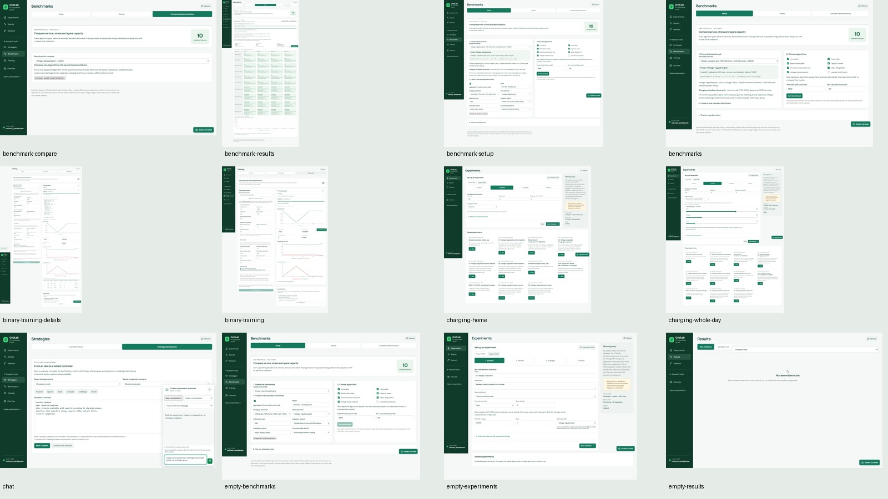
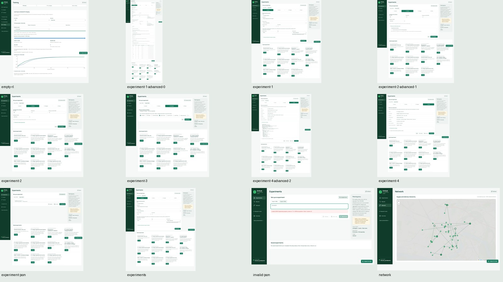
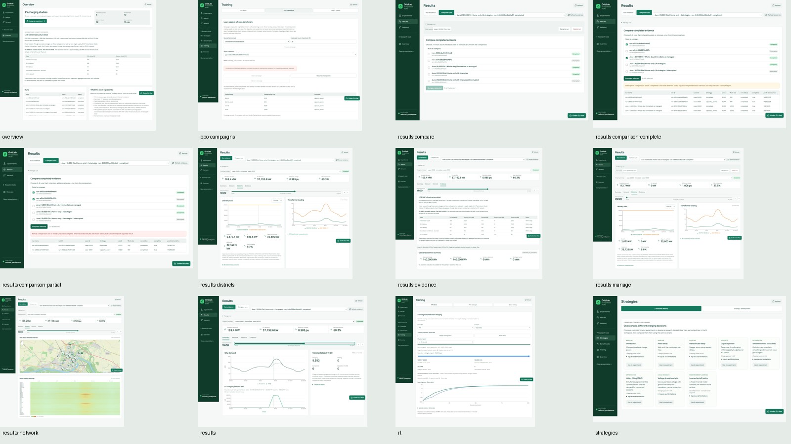
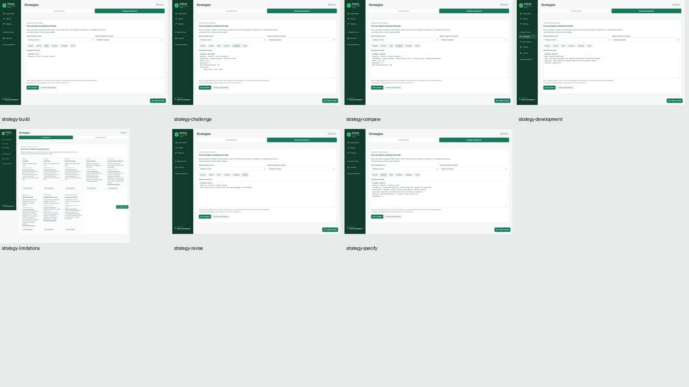

# Earlier screenshot inventory

These earlier captures remain as supplemental state coverage. The current README uses the [revised showcase](SCREENSHOTS.md).
The viewport is 1600 by 1000 pixels. Long forms use full-page captures.
Each feature links to its procedure in the [user guide](USER_GUIDE.md).

## Application

| Feature or state | Instructions | Screenshot |
| --- | --- | --- |
| benchmark compare | [Procedure](USER_GUIDE.md#benchmarks) | [benchmark-compare.png](../artifacts/handoff/screenshots/benchmark-compare.png) |
| benchmark results | [Procedure](USER_GUIDE.md#benchmarks) | [benchmark-results.png](../artifacts/handoff/screenshots/benchmark-results.png) |
| benchmark setup | [Procedure](USER_GUIDE.md#benchmarks) | [benchmark-setup.png](../artifacts/handoff/screenshots/benchmark-setup.png) |
| benchmarks | [Procedure](USER_GUIDE.md#benchmarks) | [benchmarks.png](../artifacts/handoff/screenshots/benchmarks.png) |
| binary training details | [Procedure](USER_GUIDE.md#training) | [binary-training-details.png](../artifacts/handoff/screenshots/binary-training-details.png) |
| binary training | [Procedure](USER_GUIDE.md#training) | [binary-training.png](../artifacts/handoff/screenshots/binary-training.png) |
| charging home | [Procedure](USER_GUIDE.md#experiments) | [charging-home.png](../artifacts/handoff/screenshots/charging-home.png) |
| charging whole day | [Procedure](USER_GUIDE.md#experiments) | [charging-whole-day.png](../artifacts/handoff/screenshots/charging-whole-day.png) |
| chat | [Procedure](USER_GUIDE.md#chat-and-mcp) | [chat.png](../artifacts/handoff/screenshots/chat.png) |
| empty benchmarks | [Procedure](USER_GUIDE.md#benchmarks) | [empty-benchmarks.png](../artifacts/handoff/screenshots/empty-benchmarks.png) |
| empty experiments | [Procedure](USER_GUIDE.md#experiments) | [empty-experiments.png](../artifacts/handoff/screenshots/empty-experiments.png) |
| empty results | [Procedure](USER_GUIDE.md#results) | [empty-results.png](../artifacts/handoff/screenshots/empty-results.png) |
| empty rl | [Procedure](USER_GUIDE.md#training) | [empty-rl.png](../artifacts/handoff/screenshots/empty-rl.png) |
| experiment 1 advanced 0 | [Procedure](USER_GUIDE.md#experiments) | [experiment-1-advanced-0.png](../artifacts/handoff/screenshots/experiment-1-advanced-0.png) |
| experiment 1 | [Procedure](USER_GUIDE.md#experiments) | [experiment-1.png](../artifacts/handoff/screenshots/experiment-1.png) |
| experiment 2 advanced 1 | [Procedure](USER_GUIDE.md#experiments) | [experiment-2-advanced-1.png](../artifacts/handoff/screenshots/experiment-2-advanced-1.png) |
| experiment 2 | [Procedure](USER_GUIDE.md#experiments) | [experiment-2.png](../artifacts/handoff/screenshots/experiment-2.png) |
| experiment 3 | [Procedure](USER_GUIDE.md#experiments) | [experiment-3.png](../artifacts/handoff/screenshots/experiment-3.png) |
| experiment 4 advanced 2 | [Procedure](USER_GUIDE.md#experiments) | [experiment-4-advanced-2.png](../artifacts/handoff/screenshots/experiment-4-advanced-2.png) |
| experiment 4 | [Procedure](USER_GUIDE.md#experiments) | [experiment-4.png](../artifacts/handoff/screenshots/experiment-4.png) |
| experiment json | [Procedure](USER_GUIDE.md#experiments) | [experiment-json.png](../artifacts/handoff/screenshots/experiment-json.png) |
| experiments | [Procedure](USER_GUIDE.md#experiments) | [experiments.png](../artifacts/handoff/screenshots/experiments.png) |
| invalid json | [Procedure](USER_GUIDE.md#experiments) | [invalid-json.png](../artifacts/handoff/screenshots/invalid-json.png) |
| network | [Procedure](USER_GUIDE.md#network) | [network.png](../artifacts/handoff/screenshots/network.png) |
| overview | [Procedure](USER_GUIDE.md#navigation) | [overview.png](../artifacts/handoff/screenshots/overview.png) |
| ppo campaigns | [Procedure](USER_GUIDE.md#training) | [ppo-campaigns.png](../artifacts/handoff/screenshots/ppo-campaigns.png) |
| results compare | [Procedure](USER_GUIDE.md#results) | [results-compare.png](../artifacts/handoff/screenshots/results-compare.png) |
| results comparison complete | [Procedure](USER_GUIDE.md#results) | [results-comparison-complete.png](../artifacts/handoff/screenshots/results-comparison-complete.png) |
| results comparison partial | [Procedure](USER_GUIDE.md#results) | [results-comparison-partial.png](../artifacts/handoff/screenshots/results-comparison-partial.png) |
| results districts | [Procedure](USER_GUIDE.md#results) | [results-districts.png](../artifacts/handoff/screenshots/results-districts.png) |
| results evidence | [Procedure](USER_GUIDE.md#results) | [results-evidence.png](../artifacts/handoff/screenshots/results-evidence.png) |
| results manage | [Procedure](USER_GUIDE.md#results) | [results-manage.png](../artifacts/handoff/screenshots/results-manage.png) |
| results network | [Procedure](USER_GUIDE.md#results) | [results-network.png](../artifacts/handoff/screenshots/results-network.png) |
| results | [Procedure](USER_GUIDE.md#results) | [results.png](../artifacts/handoff/screenshots/results.png) |
| rl | [Procedure](USER_GUIDE.md#training) | [rl.png](../artifacts/handoff/screenshots/rl.png) |
| strategies | [Procedure](USER_GUIDE.md#strategies) | [strategies.png](../artifacts/handoff/screenshots/strategies.png) |
| strategy build | [Procedure](USER_GUIDE.md#strategies) | [strategy-build.png](../artifacts/handoff/screenshots/strategy-build.png) |
| strategy challenge | [Procedure](USER_GUIDE.md#strategies) | [strategy-challenge.png](../artifacts/handoff/screenshots/strategy-challenge.png) |
| strategy compare | [Procedure](USER_GUIDE.md#strategies) | [strategy-compare.png](../artifacts/handoff/screenshots/strategy-compare.png) |
| strategy development | [Procedure](USER_GUIDE.md#strategies) | [strategy-development.png](../artifacts/handoff/screenshots/strategy-development.png) |
| strategy limitations | [Procedure](USER_GUIDE.md#strategies) | [strategy-limitations.png](../artifacts/handoff/screenshots/strategy-limitations.png) |
| strategy revise | [Procedure](USER_GUIDE.md#strategies) | [strategy-revise.png](../artifacts/handoff/screenshots/strategy-revise.png) |
| strategy specify | [Procedure](USER_GUIDE.md#strategies) | [strategy-specify.png](../artifacts/handoff/screenshots/strategy-specify.png) |

## Contact sheets

