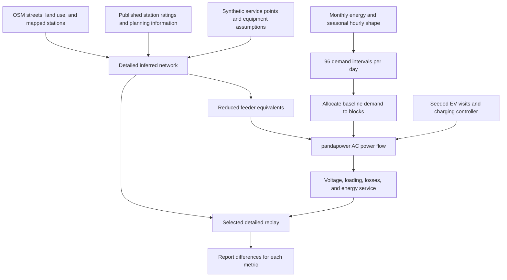

# Simulator, input data, and reduction checks

GridLab uses pandapower to solve AC power flow on a synthetic medium-voltage network.
The application combines public geographic data, published station information, supplied consumption assumptions, and inferred electrical connections.
These inputs have different evidence levels. Agreement between two synthetic models does not establish accuracy against the real grid.

## From sources to a simulated interval



## Input sources and inference

| Input | Source or construction | Evidence boundary |
| --- | --- | --- |
| Study boundary, streets, and land use | OpenStreetMap snapshot | Geographic evidence does not identify actual cable routes |
| Mapped electrical features | OpenStreetMap | Only NS5, NS7, and Rimski Sancevi have name-confirmed OSM coordinates in the reference methodology |
| Station ratings and reported planning values | EDS development plan 2025–2034 | Published planning information is not an operational asset inventory |
| Other station coordinates and associations | Planning inference from plausible geography and connections | Record each inferred association |
| 2,648 service points | Seeded synthetic demand inventory | These are not 2,648 independently observed transformer assets |
| Feeder routes | Capacity-balanced assignments and shared shortest paths along streets | Road proximity is a routing proxy |
| Cable and transformer electrical parameters | Generic planning parameters where authoritative values are unavailable | Actual equipment impedance and protection behavior remain unverified |
| Reference annual energy | Supplied 2025 total of 1,147,635 MWh | Calibration input |
| Reference coincident peak | Annual mean power multiplied by an assumed 1.64 factor | Derived 214.854 MW peak, not a measured peak |
| Seasonal hourly shapes | Supplied profiles encoded in the demand generator | The repository does not establish independent meter provenance for these profiles |
| January and June energy | Supplied scenario presets of 120,000 and 76,000 MWh | Scenario inputs, not a reconstructed twelve-month meter series |
| Aggregate capacity alignment | Supplied capacity image and explicit interpretation | Downstream shares and the 150 MW transformer-stage interpretation remain assumptions |

The [source register](data-sources-and-licenses.md) identifies OpenStreetMap attribution and the EDS publication.
Public availability does not give every source the same license.
OSM-derived data retains its ODbL attribution. The repository does not relicense the EDS publication.

The [reference model guide](models/novi-sad.md) identifies documented and inferred station associations.
The [capacity guide](capacity-alignment-2025.md) explains the later application alignment separately.

## Daily usage curves and monthly energy

The generator uses four seasonal profiles. Each contains 24 hourly shape values.
Month selection chooses the season:

| Season | Months |
| --- | --- |
| Winter | December, January, February |
| Spring | March, April, May |
| Summer | June, July, August |
| Autumn | September, October, November |

The simulator does not fit a separate measured curve for every month.
It combines the selected seasonal shape with the configured monthly energy and number of days.
The January preset uses 31 days. The June preset uses 30 days.

For monthly energy in MWh:

```text
daily_energy_kWh = monthly_energy_MWh × 1000 / days_per_month
interval_power_kW[t] = daily_energy_kWh × shape[t] / (0.25 × sum(shape))
sum(interval_power_kW) × 0.25 hours = daily_energy_kWh
```

The generator linearly interpolates between hourly values to produce 96 quarter-hour values.
Interpolation wraps from the last hour to the first hour.
Normalization preserves the configured daily energy before explicit scenario scaling.

The baseline construction follows these steps:

1. Select the seasonal hourly shape from the month.
2. Convert the monthly energy to kWh.
3. Apply compounded annual growth for the selected future year.
4. Divide by the configured number of days.
5. Interpolate and normalize the quarter-hour shape.
6. Apply the selected sensitivity and worst-case multipliers.
7. Repeat the daily profile or apply seeded daily randomization.
8. Allocate baseline power across demand blocks.

The default annual growth rate is 3%.
The lower and upper sensitivities use factors 0.971 and 1.029.
Worst-case demand multiplies the curve by 1.20.
Seeded randomization can change daily amplitude and shape within configured bounds.

Residential, commercial, and industrial archetypes distribute demand between blocks.
The `preserve_city` option normalizes the block totals at every interval to preserve the city curve.
The `preserve_energy` option permits a different aggregate shape while preserving horizon energy.
The current whole-city reduction retains all demand after source reassignment.

The implementation is in [demand.py](../src/mvgrid/novi_sad/playground/demand.py).
The [seasonal example](examples/winter-base.yaml) records the supplied-profile assumption.

## Load, grid input, and charging energy

New consumption inputs use `supply_including_losses` by default.
For each interval, the simulator solves the zero-EV baseline until external-grid power matches the supplied input within 0.01 kW.
This step establishes an accounting match to the input. It does not independently validate that input.

The simulator then adds charging demand and the resulting incremental network losses.
It does not add the original baseline losses twice.
The explicit `load` option remains available for consumption that excludes losses.

Each vehicle receives a seeded charging visit, energy request, charger rating, arrival, and departure.
Battery energy uses charging efficiency. Grid demand includes the charger input power.
The default 14 kWh request and 90% efficiency require about 15.56 kWh at the charger input when the request is fully served.

At each 15-minute interval, the controller proposes charging power for connected sessions.
pandapower computes voltage, line loading, transformer loading, and modeled losses for the resulting constant-PQ demand.
Separate aggregate checks assess district, transmission, downstream transformer, and LV capacity budgets.
These budgets do not simulate individual LV transformers, phase imbalance, protection trips, or LV feeder voltage.

See [loss accounting](baseline-loss-diagnosis.md) and [charging visits](whole-day-charging.md).

## How the model became smaller

The detailed reference contains 21,783 buses, 21,759 lines, 15 transformers, and 2,648 synthetic loads across nine source islands.
The application reduction contains 76 buses, 58 lines, and 12 transformers.
Its 42 demand blocks and ten hubs span six retained supply areas.
Demand from NS1, NS6, and FUT is reassigned. All 2,648 original demand members remain represented in the current whole-city variant.

The reduction retains upstream transformer chains and represents downstream feeder trees with electrical equivalents.
This makes repeated charging experiments practical without solving every detailed street segment at every interval.
It also removes information about individual positions within each block.

An earlier equivalent overestimated voltage drop by applying total block demand to an average complete path impedance.
The corrected method accounts for the downstream demand carried by each branch:

```text
branch_fraction[e] = downstream_power[e] / total_block_power
weighted_path_impedance[m] = sum(branch_impedance[e] × branch_fraction[e])
```

The method selects the member path with the largest first-order voltage-drop term at the assumed 0.97 power factor.
It uses that path to construct the equivalent.
A separately tested loss-weighted alternative uses squared branch fractions.
That alternative can improve loss matching while understating the weakest voltage drop, so it did not replace the voltage screen.

This is a targeted reduction correction. It does not preserve every AC quantity exactly.
Shared-feeder coupling, losses, and the effects of within-block EV placement remain approximate.
See [feeder_equivalent.py](../src/mvgrid/novi_sad/playground/feeder_equivalent.py) and the [reduction diagnosis](baseline-loss-diagnosis.md#reduction-correction).

## Charging optimization is a separate operation

Network reduction reduces computational work. Charging optimization changes when connected vehicles receive power.
The controller library includes immediate and delayed baselines, capacity-aware allocation, smoothed least laxity first, valley filling, voltage feedback, and learned policies.

The comparison holds demand, EV visits, seeds, and electrical limits fixed where the protocol requires matched cases.
Controllers receive the information permitted by their observation contract.
Forecast-based controllers do not receive future arrivals.
Metrics include energy delivery, departure shortfall, peak demand, electrical limits, fallback actions, and runtime.

The regulated operating scenario separately applies a 1.04 pu source setting and an energy-preserving 220 MW baseline peak cap.
Those settings are explicit counterfactual assumptions. They are not evidence that model reduction became more accurate.
The [README controller section](../README.md#charging-algorithms) explains each charging rule.

## What the detailed comparison measured

The comparison replays selected reduced-model block dispatch into the detailed network.
Member baseline shares allocate power within each block. Illustrative public hubs use an explicit transformer-side connection.
The checker applies recorded operating and capacity-alignment settings when present.
It solves detailed AC power flow and records a difference for each reported metric.

The [saved comparison](../artifacts/playground/evidence/model_validation.json) contains one selected no-EV snapshot from a 150 MW delivered-load workflow.
Its saved fingerprint identifies the implementation used for that check.
The values below come from its `comparison.snapshots[0]` record.

| Metric | Detailed model | Reduced model | Absolute difference | Relative difference |
| --- | ---: | ---: | ---: | ---: |
| Minimum voltage | 0.981538 pu | 0.975102 pu | 0.006436 pu | 0.656% |
| Maximum line loading | 49.1125% | 50.3952% | 1.2827 percentage points | 2.612% |
| Maximum transformer loading | 52.1081% | 53.2799% | 1.1718 percentage points | 2.249% |
| Modeled losses | 1,558.809 kW | 1,932.508 kW | 373.699 kW | 23.973% |

For each metric, the relative difference uses the detailed value as its denominator:

```text
relative_difference_percent = 100 × abs(reduced - detailed) / abs(detailed)
```

Subtracting the minimum-voltage relative difference from 100 gives 99.344%.
That arithmetic describes agreement in one reported voltage metric at one snapshot.
It is not an established score for overall simulator accuracy.
The loading and loss differences show why that broader claim would be misleading.

The [seasonal diagnosis](baseline-loss-diagnosis.md#reduction-correction) also reports selected June, January, and stressed-demand snapshots.
Those checks support the reduction correction under the tested conditions.
They do not establish full-year agreement, identical EV capacity thresholds, or preserved controller rankings.
The current documentation review recalculated the table from saved evidence. It did not rerun the detailed solver.

## What a broader accuracy claim would require

A broader reduction claim needs a defined metric and a representative comparison set.
That set must cover seasons, fleet sizes, locations, operating modes, and charging strategies.
It must report voltage, loading, losses, threshold disagreements, and controller-ranking disagreements.
A claim about real-grid accuracy additionally requires independent measured network and demand data.

Until those checks exist, use this statement:

> The reduced model differed from the detailed synthetic model by 0.00644 pu in minimum voltage at the documented snapshot.
> Other metrics had larger differences, including about 24% for modeled losses.

## Reproduction and inspection

The detailed replay implementation is [detailed.py](../src/mvgrid/novi_sad/playground/detailed.py).
The reduction investigation has a Windows-compatible launcher:

```powershell
.\.venv\Scripts\python.exe .\scripts\diagnose_baseline.py
```

This diagnostic performs additional simulations and writes diagnostic artifacts.
It is separate from setup and ordinary startup.
Read its configuration and the [reproduction guide](reproducibility.md) before regenerating evidence.
The detailed reference requires the documented source files. Exact reference regeneration also requires the trusted local OSM cache.
