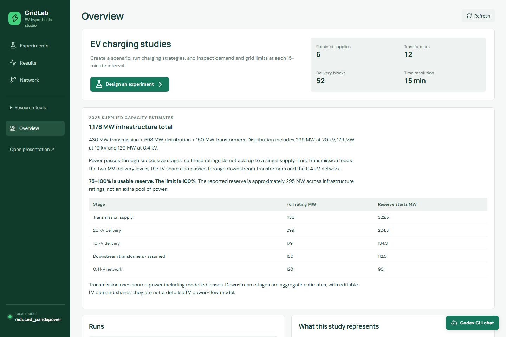
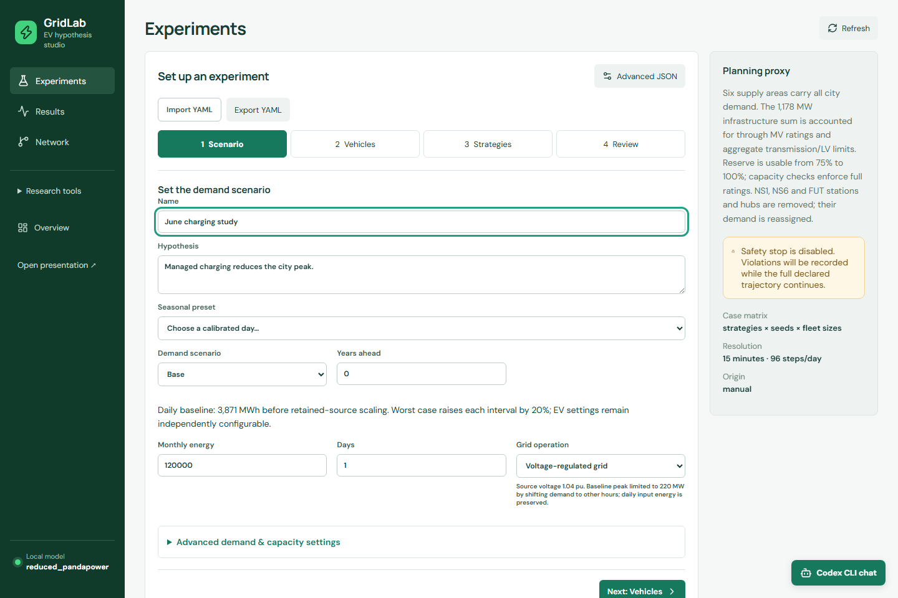
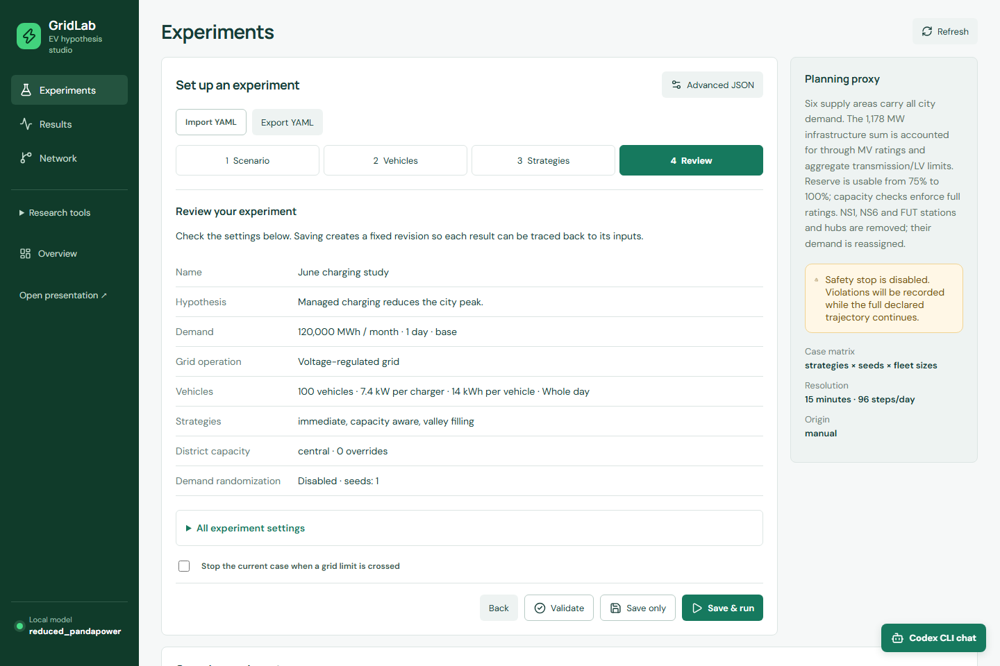
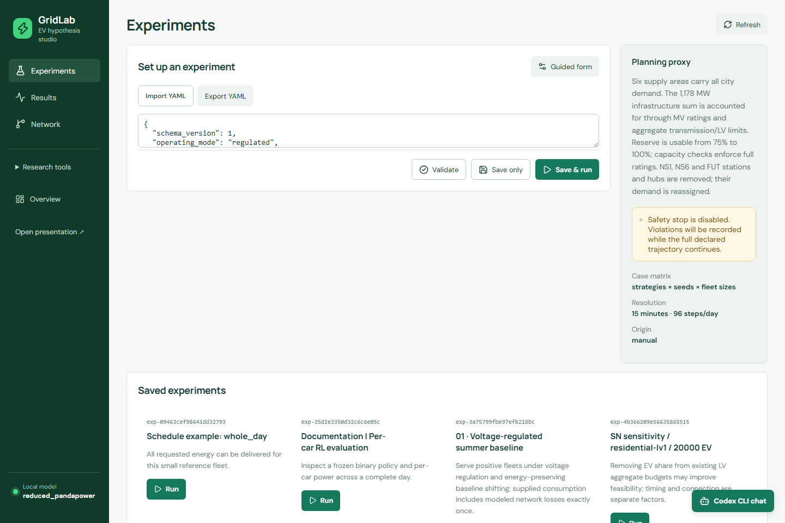
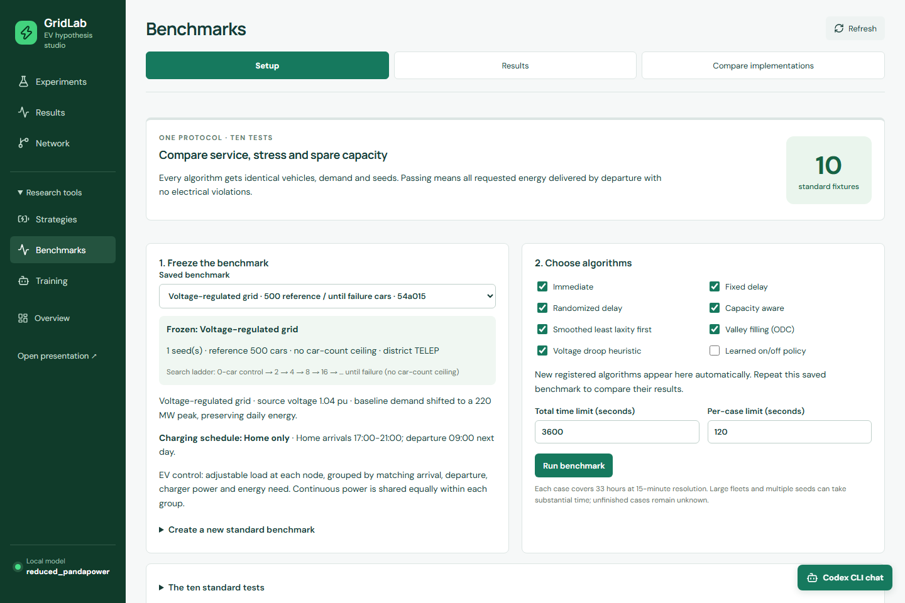

# GridLab user guide

This guide describes the Windows application.
Follow the [README setup](../README.md#start-on-windows) before using these procedures.
The [configuration reference](CONFIGURATION.md) lists schema defaults and accepted values.

## Navigation

The primary pages are **Experiments**, **Results**, and **Network**.
Expand **Research tools** for **Strategies**, **Benchmarks**, and **Training**. **Overview** summarizes the project.
The presentation and Codex chat have separate controls.

Browser Back, Forward, and reload preserve the selected page and run through URL parameters.
An unsaved experiment draft survives navigation within the app. A page reload does not save that draft.
Use **Save only** to preserve a definition before leaving the session.

## Experiments

An experiment defines inputs and acceptance rules. A run executes that definition.
Editing a saved definition creates a new revision when saved. Existing run evidence remains unchanged.

### Scenario

| Setting | Purpose and behavior |
| --- | --- |
| Name | Identify the experiment in the local catalog |
| Hypothesis | State the expected effect before inspecting results |
| Calibrated day | Apply a seasonal demand preset |
| Base / worst-case day | Apply normal demand or a 20% increase |
| Simulation days | Set the requested duration. Departure completion can extend it |
| Years ahead | Apply annual compounded growth |
| Grid operation | Select original assumptions or voltage-regulated operation |

January presets use 120,000 MWh over 31 days. June presets use 76,000 MWh over 30 days.
Annual growth defaults to 3%. These values are scenario assumptions.
**Voltage-regulated grid** sets source voltage to 1.04 pu and shifts baseline demand above 220 MW while preserving daily energy.
Original operating assumptions remain available. Neither mode changes the acceptance limits.

### Advanced demand and capacity

| Setting | How to use it |
| --- | --- |
| Monthly energy and unit | Enter the calibration total in MWh or kWh |
| Month and days per month | Select the seasonal shape and daily energy allocation |
| Annual growth rate | Enter the fractional annual increase |
| Demand scope | Use city total for citywide calibration or active sources for an already scoped input |
| Measurement | Distinguish grid input including losses from delivered load excluding losses |
| Demand composition | Set residential, commercial, and industrial fractions together. Their sum must equal one |
| Randomized demand | Generate seeded daily scale and shape changes |
| Minimum / maximum daily scale | Bound randomized amplitude. Minimum cannot exceed maximum |
| Shape noise | Set variation in the daily curve |
| Baseline demand on LV | Set the baseline share that reaches the aggregate LV stage |
| EV charging on LV | Set the EV share that reaches that stage |
| District capacity scenario | Use low, central, or high estimates |
| District overrides | Supply a central kW estimate and its provenance |

Central district capacities total 478 MW. Low and high sensitivity factors are 0.8 and 1.2.
The final 25% of capacity is usable reserve. Reserve use starts above 75%, and violations start above 100%.
Aggregate transmission, downstream-transformer, and LV limits remain separate from district budgets.
The LV shares default to 50% of baseline load and 100% of EV load.

District overrides require a nonblank provenance explanation. Scenario factors also apply to overridden central estimates.
A district is an electrical study group, not a verified municipal boundary.

### Vehicles

| Setting | Meaning |
| --- | --- |
| Fleet size | Number of daily vehicle participants |
| Charger power | Maximum charging power per vehicle in kW |
| Energy per vehicle | Requested battery energy in kWh |
| Charging efficiency | Fraction of charger energy delivered to the battery |
| Charging schedule | Home only, whole day, or the preserved legacy mixed schedule |
| Whole-day shares | Home, workplace, and public charging fractions |
| District placement | Optional probabilities for vehicle allocation across districts |
| Fleet-size sweep | Multiple fleet sizes in one case matrix through Advanced JSON |

Default vehicle parameters are 100 vehicles, 7.4 kW, 14 kWh, and 90% charging efficiency.
A 14 kWh request is a daily energy increment, not a complete battery charge.
Whole-day shares default to 70% home, 20% workplace, and 10% public.
Moving one slider adjusts the other shares proportionally, keeping the total at 100%.

| Schedule location | Arrival window | Departure behavior |
| --- | --- | --- |
| Home | 17:00–21:00 | Departure at 09:00 the next day |
| Workplace | 07:00–10:00 | Departure between 15:00 and 19:00 |
| Public | 00:00–23:45 | Stay for 3–4 hours |

The profile creates one visit per vehicle per day. It does not simulate repeated daily travel between locations.
Fixed night-delay policies can miss daytime departures.
District probabilities sum to one. Seeded finite fleets can differ from the requested percentages.

### Strategies

| Controller | Behavior | Interpretation |
| --- | --- | --- |
| `immediate` | Charge upon connection | Does not automatically reduce power for grid limits |
| `fixed_delay` | Wait for a common start hour | Can create a new synchronized peak |
| `randomized_delay` | Apply seeded delays | Spreads start times but does not guarantee service |
| `capacity_aware` | Prioritize departures within available budgets and AC checks | Heuristic control under the modeled constraints |
| `least_laxity_first` | Smooth allocation using remaining charging-time margin | Includes bounded numerical and resource fallbacks |
| `valley_filling` | Schedule against lower predicted baseline demand | Bounded ODC adaptation with diagnostics |
| `voltage_responsive` | Adjust charging from causal voltage observations | Custom voltage heuristic with central protection |
| `rl` | Use a saved binary policy | Requires a locally trained model |

The historical `mpc` controller is absent from active application selections.
Selecting several strategies creates a comparison batch with matched inputs and seeds.
The GUI disables case stopping by default for a multi-strategy comparison.
An individual case failure does not suppress the remaining comparison cases. Global cancellation and time limits still apply.

Controller settings in Advanced JSON control forecasts, optimization limits, fallback behavior, and voltage response.
Consult [strategy methods](strategy-development.md) before changing them.
Unsupported settings fail validation rather than silently changing a controller.

### Review, JSON, and acceptance rules

1. Open **Review**.
2. Check the demand, vehicles, selected strategies, operating mode, and seeds.
3. Expand **All experiment settings** to inspect the complete definition.
4. Select **Validate**.
5. Select **Save only** or **Save & run**.

**Validate** checks the definition. It does not establish electrical feasibility.
If starting fails after saving, the definition remains available in **Saved experiments**. Use its **Run** control to retry.
**Stop the current case when a grid limit is crossed** preserves partial evidence at the first monitored violation.
A stopped or incomplete case cannot count as a pass.

**Advanced JSON** supports settings that do not have dedicated form controls.
These include fleet sweeps, case budgets, solver controls, detailed checks, and assertions.
Use valid finite numbers. Unknown fields, invalid ranges, and malformed JSON are rejected.

| Advanced group | Purpose |
| --- | --- |
| Seeds and fleet sizes | Define the strategy × seed × fleet case matrix |
| Maximum cases and time | Bound execution work |
| Stress ordering | Inspect high-demand intervals first where supported |
| Voltage and loading limits | Define the accepted electrical range |
| Hard assertions | Compare one metric with a specified bound |
| Paired assertions | Compare peak demand between matched candidate and control cases |
| Detailed check | Check selected snapshots with the detailed network |
| Node aggregation | Group compatible vehicles for node-level continuous control |
| Strategy options | Configure controller-specific forecasts and numerical behavior |
| RL settings | Freeze a model, shield, energy budget, and scoring weights |

Default voltage limits are 0.95–1.05 pu. The default loading limit is 100%.
Do not relax a limit to describe a failed case as validated.
Node aggregation can change greedy allocation behavior. It is incompatible with the binary RL controller.

## Results

Select a run from the local catalog. Wait for its evidence to load.
Use **Refresh** during execution and **Cancel** to request a stop.
Supported interrupted runs expose **Resume**. Resume checks input and implementation compatibility.

| Result area | What to inspect |
| --- | --- |
| Summary | Completion, verdict, peak demand, energy service, and worst electrical values |
| Demand charts | City MW, EV kW, and synchronized interval markers |
| Charging | Connected, charging, completed, and waiting vehicle counts |
| Network | Frozen hierarchy and electrical conditions at the selected interval |
| District evidence | Loading, capacity, headroom, reserve use, and vehicle allocation |
| Constraint events | Voltage, line, transformer, district, and aggregate-stage violations |
| Evidence | Definition, seeds, fingerprints, and interpretation |
| RL diagnostics | Reward components, charging actions, shield intervention, and charger timelines |

Use **Simulation time** to select an interval. Compare units before interpreting the curves.
A connected vehicle can be charging, waiting, or already complete.
A completed vehicle can remain connected until departure.

| Status or finding | Meaning |
| --- | --- |
| Completed | Execution ended. Inspect the evaluation separately |
| Evaluated without assertions | No explicit assertions were attached. This is not an asserted scientific pass |
| Failed or violation-stopped | A failure or limit event prevents acceptance |
| Cancelled or interrupted | The run does not contain complete evidence |
| Time limit exceeded | The configured work budget ended before completion |
| Unmet energy | A vehicle did not receive its requested energy before departure |
| Nonconvergence | The solver did not establish a valid electrical result |

### Hourly map and heatmap

1. Select a completed run and its charging strategy.
2. Open the **Network** result tab.
3. Move **Simulation time** to the required 15-minute interval.
4. Wait for the map tiles and recorded measurements to load.
5. Select a car badge to inspect the block's vehicle counts.
6. Inspect the block loading heatmap for changes across the full run.

Car badges aggregate connected visits at demand blocks. They are not moving GPS positions.
Charging, waiting, completed, and departed-shortfall counts describe different recorded states.

Gray heatmap cells mean unknown electrical results.
Use the **Districts** tab for exact district load, capacity, headroom, and transformer curves.
Use **Evidence** for energy service and assertion outcomes.

### Individual charger demand

This view requires a completed compatible RL evaluation with individual vehicle records.

1. Select its case in **Results**.
2. Open **RL controller**.
3. Inspect the reward components and requested-versus-executed charging.
4. Scroll to **Charger on / off timeline**.
5. Select or hover a cell to inspect the car and interval.
6. Read applied charging power in kW and remaining battery demand in kWh.
7. Filter by district or use pagination to inspect other cars.

Keyboard focus also selects a timeline cell.
The inspector shows its own interval. The blue column retains the global result interval.
Remaining battery demand is energy, not charging power. Check departure shortfall separately before accepting service.

### Manage and compare saved runs

1. Expand **Manage run**.
2. Edit **Run name**.
3. Select **Rename run**.

**Delete run** removes a run from the visible catalog. **Undo delete** restores it.
Cancel an active run before deleting it. These controls do not rewrite its numerical case evidence.

To compare runs:

1. Select **Compare runs**.
2. Select between two and eight runs.
3. Select **Compare selected**.
4. Read the compatibility explanation before comparing metrics.

Input, implementation, and coverage differences can make a comparison invalid or inconclusive.
A lower peak is not an improvement if energy delivery or grid limits fail.

## Network

Large result files and map tiles can take several seconds to load.
Wait for the plots and status information before interpreting the selected run.

Inspect the source hierarchy, demand blocks, charging hubs, and district estimates.
Use map zoom and node selection to inspect the network.
The reduced model excludes NS1, NS6, and FUT supplies while reassigning their former demand.
It preserves all 2,648 city demand members through that reassignment.

The presentation's detailed geographic model contains nine primary stations and inferred routes.
It serves a different purpose from the reduced experiment network.
External OSM map tiles require internet access. The bundled geographic scene uses local geometry.

## Strategies

**Controller library** explains implementations and their research basis.
**Strategy development** provides a structured command editor and saved records.

1. Open **Strategy development**.
2. Select the required workflow stage.
3. Enter the objective, observations, constraints, and failure behavior.
4. Inspect the generated command.
5. Select **Save / prepare**.
6. Select **Read selected record** to inspect the saved output.

Proposal and specification records do not implement Python code.
Implementation requires the explicit coding workflow and a saved specification.
Verification binds code and test evidence to the corresponding specification.
Comparison uses the shared simulator and frozen scenario conditions.
See [strategy development](strategy-development.md) and the [agent contract](agent-contract.md) for command formats.

## Benchmarks

The [README benchmark tour](../README.md#benchmarks) explains the rationale for all ten tests and shows retained dashboard evidence.

A benchmark suite freezes ten scenarios. A benchmark job runs selected controllers against that suite.

1. Open **Setup** in Benchmarks.
2. Expand **Create a new standard benchmark**.
3. Set the name, charging schedule, grid operation, fleet size, search method, seeds, and district.
4. Select **Freeze 10-test benchmark**.
5. Select controllers and execution time limits.
6. Select **Run benchmark**.
7. Open **Results** to inspect the matrix and cell details.

| Setting | Meaning |
| --- | --- |
| Reference cars | Shared fleet for fixed tests and shared-fleet searches |
| Capacity search | Doubling until failure or a reference ladder with one-car refinement |
| Search ceiling | Upper tested fleet for a bounded search |
| Evaluation seeds | Identical replay seeds for competing controllers |
| Concentrated district | District used by concentrated-demand tests |
| Aggregate EV control | Use compatible vehicle groups for continuous node control |
| Total time limit | Budget for the benchmark job |
| Per-case limit | Budget for one case |
| Frozen RL policy | Model used when binary RL is selected |

The ten tests cover shared passing fleet, winter, worst winter, worst summer, synchronized arrivals, and a concentrated district.
They also include normal and worst-day capacity searches for the city and one district.
**Compare implementations** compares compatible completed jobs on the same suite.
Inspect [the benchmark protocol](benchmark.md) for test definitions and search semantics.

Capacity means the largest passing tested fleet. Every seed must complete service and satisfy limits.
A passing ceiling, baseline failure, unknown result, and incomplete job have different meanings.
Shared-fleet headroom depends on the selected controller cohort and cannot establish a cross-job ranking.

## Training

### PPO demo

The **PPO demo** shows synthetic learning data, episode progress, and charging behavior.
Use its playback controls and episode selection to inspect the illustration.
It does not start training or establish controller quality.

### PPO campaigns

PPO learns continuous node power allocations against frozen benchmark evidence.
RL packages are part of standard Windows setup.

1. Complete an appropriate benchmark study.
2. Open **PPO campaigns**.
3. Select **Source benchmark**.
4. Set **Campaign hours**, from 1 to 12.
5. Select **Freeze campaign**.
6. Inspect the frozen conditions.
7. Select **Start campaign**.

Use **Saved campaign** to inspect phase, elapsed time, anchor fleets, and evaluation status.
**Cancel campaign** requests a stop. **Resume checkpoints** continues a supported stopped campaign.
Queue time is separate from active training time.
The objective requires matched held-out service and electrical checks before peak comparisons.
Partial blocks cannot establish improvement. See [continuous RL](continuous-rl.md).

### Binary training

Binary REINFORCE requests charge or wait for each connected vehicle.

1. Save an experiment with compatible individual vehicle control.
2. Open **Binary training**.
3. Select its source experiment or save the current draft through the training form.
4. Set episodes, seed, learning rate, discount factor, and maximum duration.
5. Set demand randomization, reward weights, shield, and any daily energy budget.
6. Start training.
7. Inspect episode history and saved model information.
8. Use the saved model in an experiment with separate evaluation seeds.

| Parameter | Initial value | Meaning |
| --- | --- | --- |
| Episodes | 20 | Maximum sampled training episodes |
| Seed | 10000 | Reproducible training randomization |
| Learning rate | 0.01 | Policy update step |
| Discount factor | 0.99 | Weight of future reward |
| Duration | 600 seconds | Training time budget |
| Daily scale | 0.8–1.2 | Randomized demand amplitude |
| Shape noise | 0.1 | Variation in demand shape |
| Shield | Enabled | Remove whole charging requests that fail protection checks |
| Daily energy budget | Disabled | Optional baseline-plus-EV load budget excluding AC losses |

Reward weights initially use delivery 1, shortfall 10, capacity 1000, energy 1000, switching 0.05, peak 0.1, and intervention 10.
A daily energy budget resets at midnight. Baseline demand can exceed it even with all chargers off.
Selecting a model loads its training settings. Evaluation reward changes rescore behavior without changing the saved policy.
Changed learning objectives require new training. See [binary RL](models/ev-rl.md).

## Chat and MCP

The [MCP inventory](../README.md#tool-inventory) groups all 39 current project tools by workflow.

The chat uses Codex CLI authentication on the current Windows account.
Install and authenticate the CLI before sending a message. Never place credentials in this repository.

| Control | Purpose |
| --- | --- |
| Conversation selector | Create or revisit local conversations |
| More conversations | Retrieve older catalog entries |
| Task focus | Select explanation, algorithms, scenarios, execution, comparison, diagnosis, training, benchmarks, or implementation |
| Saved specification | Identify the specification for explicit implementation |
| Pinned constraints | Preserve exact constraints with the next message |
| Tool details | Inspect arguments and returned evidence |
| All saved tool evidence | Open the complete archived tool output |
| Cancel | Stop the current response |
| Minimize | Hide the panel while preserving the conversation |

Enter sends the message. Shift+Enter inserts a newline.
Cancelling a response does not stop experiments already accepted by the simulation service.
Use the experiment or benchmark controls to cancel those jobs.

MCP clients can start `scripts/run_playground_mcp.py` with the repository Python executable.
Use the current catalog and contract before preparing structured requests.
The project plugin provides the same simulator workflow without requiring an open web application.
See [agent contract](agent-contract.md) for installation and tool details.

## Troubleshooting and terminology

| Term | Meaning |
| --- | --- |
| EV | Electric vehicle |
| MV / LV | Medium voltage / low voltage |
| kW / MW | Power. One MW equals 1,000 kW |
| kWh / MWh | Energy. One MWh equals 1,000 kWh |
| pu | Per-unit voltage relative to nominal voltage |
| AC power flow | Electrical calculation for voltage, loading, and losses |
| Seed | Input that makes pseudorandom generation repeatable |
| Headroom | Remaining modeled power or energy budget |
| MCP | Model Context Protocol for tools |
| MPC | Model predictive control, a different concept |
| RL / PPO | Reinforcement learning / proximal policy optimization |

Use the [Windows troubleshooting guide](TROUBLESHOOTING.md) for startup, map loading, missing records, training, and benchmark failures.
For missing results, first check run status and whether the catalog belongs to this checkout.
For invalid comparisons, inspect frozen definitions and implementation fingerprints.
For baseline violations, inspect the zero-EV network conditions before changing the charging controller.
